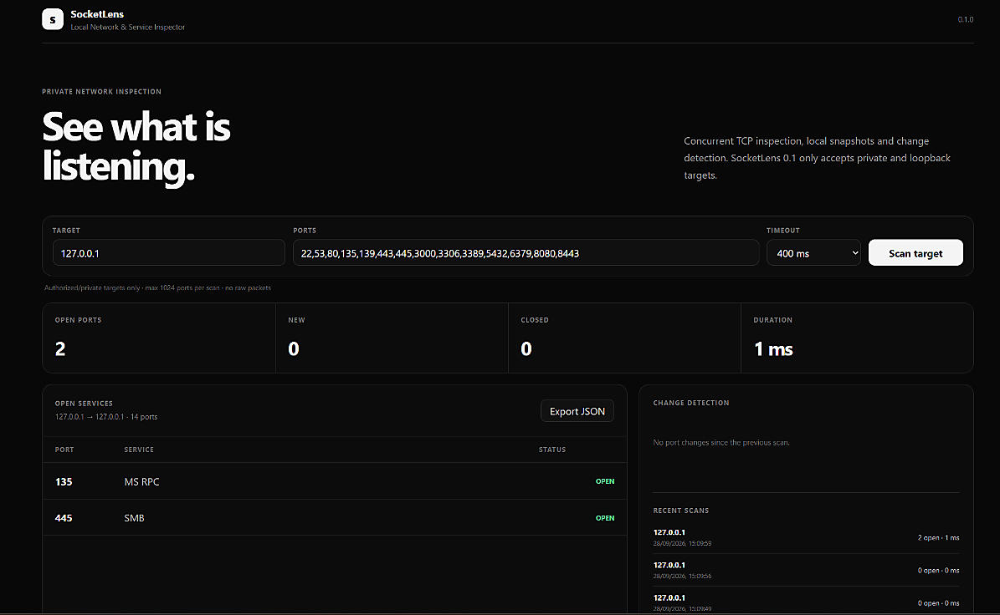

# SocketLens

**Local Network & Service Inspector**

SocketLens is a local-first TCP service inspector built in Go. It scans authorized private or loopback targets, stores snapshots in SQLite and highlights port changes between scans.



## Highlights

- Concurrent TCP scanning with a bounded worker pool
- Private/loopback target enforcement
- Custom port lists and ranges
- Common service identification
- Snapshot diffing
- Newly-open and closed port detection
- SQLite scan history
- JSON export
- Embedded dark dashboard
- Single Go executable
- Automated tests
- GitHub Actions CI
- End-to-end verification script

## Safety scope

SocketLens 0.1 is intentionally limited to private and loopback targets.

It does not implement:

- public Internet scanning
- raw packet scans
- credential guessing
- exploit execution
- vulnerability exploitation

Use it only on systems and networks you own or are authorized to inspect.

## Stack

- Go
- SQLite
- HTML / CSS / JavaScript
- GitHub Actions

The web UI is embedded into the Go executable.

## Verify

```powershell
.\tools\verify.cmd
```

The verification suite runs:

- formatting gate
- `go vet`
- Go tests
- production build
- API runtime smoke test
- embedded dashboard smoke test
- real loopback TCP scan
- SQLite history persistence check

## Run

```powershell
.\tools\start.cmd
```

Then open:

```text
http://127.0.0.1:8790
```

## Build a release

```powershell
.\tools\build-release.ps1
```

Output:

```text
artifacts\release\SocketLens.exe
```

## Example ports

```text
22,53,80,135,139,443,445,3000,3306,3389,5432,6379,8080,8443
```

Ranges are supported:

```text
8000-8010
```

## Architecture

See [docs/ARCHITECTURE.md](docs/ARCHITECTURE.md).

## License

MIT
